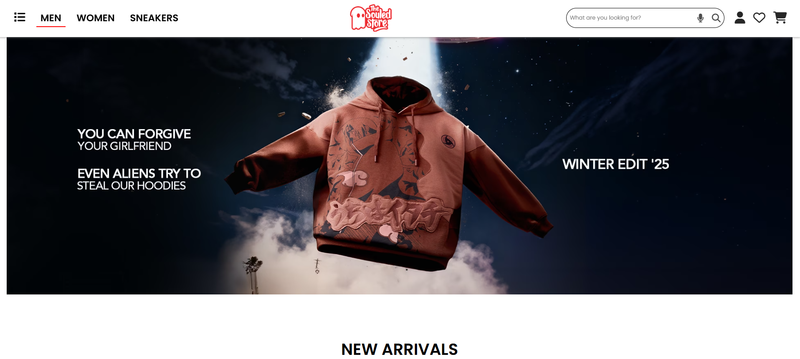

# The Souled Store – E-Commerce Landing Page (Clone)

A fully responsive e-commerce landing page inspired by **The Souled Store**.  
This project recreates a modern shopping interface using **HTML, CSS, Bootstrap**, and **Font Awesome**, focusing on clean UI, product sections, responsiveness, and real-world layout structure.

---

## Features

- Fully responsive design (mobile, tablet, desktop)
- Clean navigation bar with menu, search bar, and icons
- Product sections:
  - **New Arrivals**
  - **Categories**
  - **Fresh on Deck**
  - **Ollivander's Corner**
- Smooth hover animations & transition effects
- Footer with social links and helpful navigation
- Two complete versions included:
  - **HTML + CSS Version**
  - **Bootstrap Version (with improved responsiveness)**

---

## Tech Stack

- **HTML5**
- **CSS3 (Custom Styling)**
- **Bootstrap 5**
- **Font Awesome Icons**

---

## Project Structure

/souled.html             → Custom CSS version  
/souled.css              → Styling for custom version  

/souled-boot.html        → Bootstrap layout version  
/souled-boot.css         → Additional styling for Bootstrap  

/assets/                 → Images (banners, category pics, products)

---

# UI Highlights

- Product grid layout with CSS Grid / Bootstrap Grid
- Smooth hover scaling and shadow effects
- Sticky header
- Full-width hero sections
- Organized, modular sections for easy editing

---

